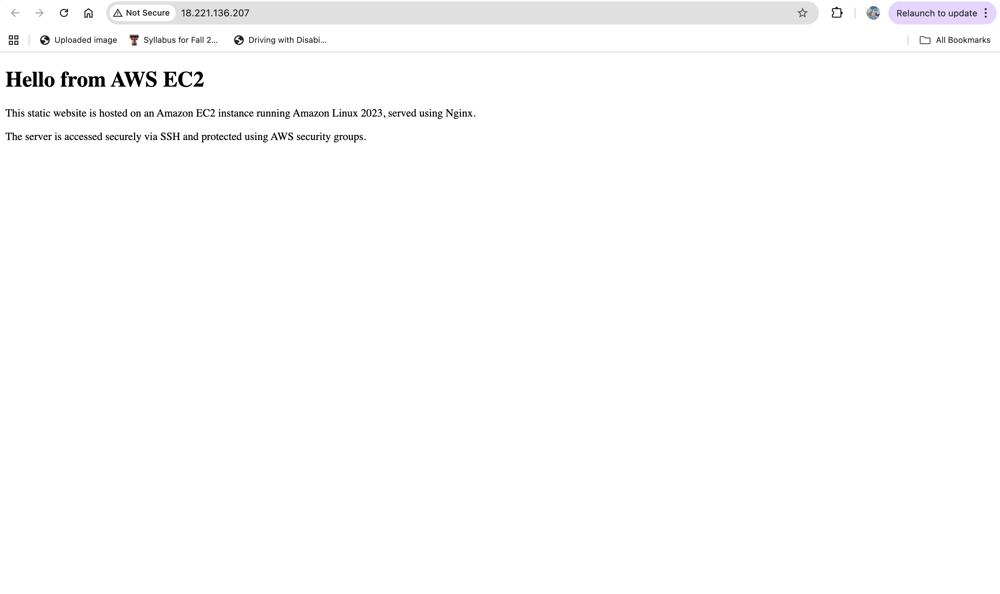
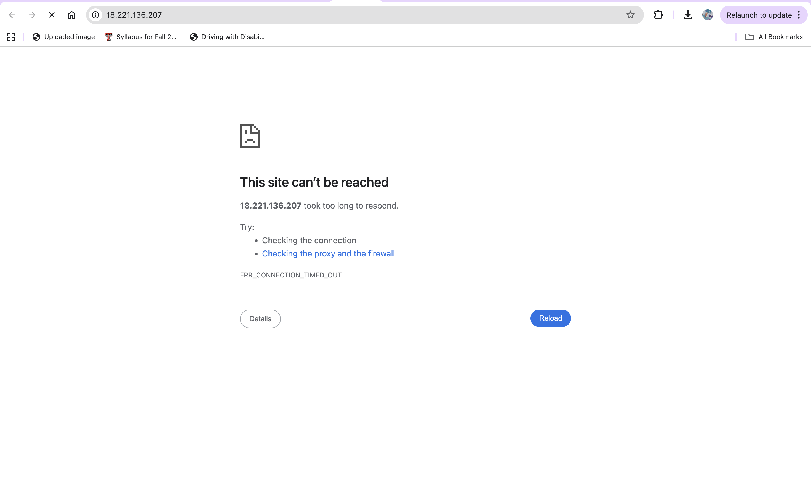
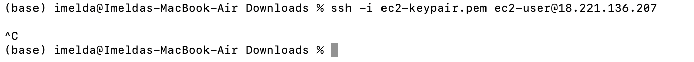
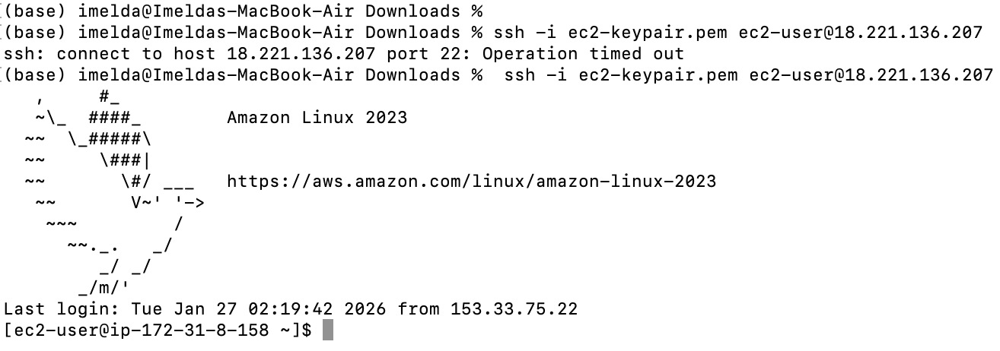

# Project 1: EC2 Web Server Deployment & Troubleshooting

This project documents my first hands-on experience deploying and troubleshooting a web server on AWS. Beyond simply launching infrastructure, I intentionally introduced failures to understand how cloud systems break and how to diagnose issues methodically.

This helped me move from “I built it” to **“I understand why it works — and why it fails.”**

---

## Initial Deployment

I launched an EC2 instance running **Amazon Linux 2023**, installed **NGINX**, and deployed a static website accessible through the instance’s public IP.



---

## Experiment 1: Breaking HTTP Access (Network-Level Failure)

I removed **port 80 (HTTP)** from the EC2 security group inbound rules.

### Symptom
The website became unreachable in the browser.



### Investigation
I verified that:
- The EC2 instance was still running
- NGINX was still installed
- HTTP traffic was no longer allowed in the security group


### Root Cause
Inbound HTTP traffic was blocked at the security group level.

### Resolution
I re-added port 80 to the inbound rules, restoring public access.

---

## Experiment 2: Breaking SSH Access (Access-Level Failure)

Next, I removed **port 22 (SSH)** from the security group.

### Symptom
SSH attempts hung and eventually timed out.



### Key Learning
- SSH is strictly for **administrative access**
- Blocking SSH does **not** affect website availability
- A timeout indicates traffic is being blocked before reaching the instance

### Resolution
After restoring port 22, SSH access was immediately restored.



---

## Experiment 3: Stopping NGINX (Service-Level Failure)

I then stopped the NGINX service directly on the instance.

```bash
sudo systemctl stop nginx
